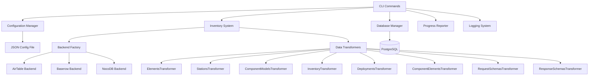

# Design Document

## Overview

The inventory CLI will be implemented as a typer-based command-line interface that integrates with the existing mbx-inventory package to provide inventory synchronization capabilities. The CLI will follow the same pattern as the existing mbx-db CLI, providing commands for configuration, validation, and synchronization of inventory data from various backends (AirTable, Baserow, NocoDB) to PostgreSQL.

The design leverages the existing inventory system architecture, including the Inventory class, NetworkSchemaMixin, transformers, and backend implementations, while adding CLI-specific functionality for configuration management, progress reporting, and database operations.

## Architecture

### High-Level Architecture



### CLI Command Structure

```
mbx-inventory
├── validate          # Validate backend connection and configuration
├── sync              # Sync data from backend to PostgreSQL
│   ├── --dry-run     # Preview changes without executing
│   ├── --tables      # Sync specific tables only
│   └── --verbose     # Detailed logging
└── config            # Configuration management
    ├── show          # Display current configuration
    └── validate      # Validate configuration file
```

## Components and Interfaces

### 1. Configuration Manager

**Purpose**: Handle loading, validation, and management of inventory configuration.

**Interface**:
```python
class InventoryConfig:
    backend_type: str
    backend_config: Dict[str, Any]
    database_config: Dict[str, str]
    table_mappings: Optional[Dict[str, str]]
    sync_options: Dict[str, Any]
    
    @classmethod
    def load_from_file(cls, config_path: Path) -> 'InventoryConfig'
    
    def validate(self) -> bool
    def get_backend_instance(self) -> InventoryBackend
```

**Configuration File Schema** (JSON):
```json
{
  "backend": {
    "type": "airtable",
    "config": {
      "api_key": "${AIRTABLE_API_KEY}",
      "base_id": "${AIRTABLE_BASE_ID}"
    }
  },
  "database": {
    "host": "${POSTGRES_HOST}",
    "port": "${POSTGRES_PORT}",
    "database": "${POSTGRES_DB}",
    "username": "${POSTGRES_USER}",
    "password": "${POSTGRES_PASSWORD}"
  },
  "table_mappings": {
    "elements": "Elements",
    "stations": "Stations"
  },
  "sync_options": {
    "batch_size": 100,
    "timeout": 30,
    "retry_attempts": 3
  }
}
```

### 2. CLI Application

**Purpose**: Main typer application with command definitions and user interaction.

**Interface**:
```python
app = typer.Typer(
    name="mbx-inventory",
    help="Inventory synchronization CLI for Mesonet-in-a-Box"
)

@app.command()
def validate(config_file: Path) -> None

@app.command() 
def sync(
    config_file: Path,
    dry_run: bool = False,
    tables: Optional[List[str]] = None,
    verbose: bool = False
) -> None
```

### 3. Database Manager

**Purpose**: Handle PostgreSQL database operations for data synchronization. This will be implemented as extensions to the existing mbx-db module.

**Interface** (to be added to mbx-db):
```python
# New functions to be added to mbx-db
async def sync_table_data(
    engine: AsyncEngine,
    table_name: str, 
    data: List[Dict[str, Any]],
    dry_run: bool = False
) -> SyncResult

async def get_existing_records(
    engine: AsyncEngine,
    table_name: str
) -> List[Dict[str, Any]]

async def upsert_records(
    engine: AsyncEngine,
    table_name: str,
    records: List[Dict[str, Any]]
) -> UpsertResult
```

### 4. Sync Engine

**Purpose**: Orchestrate the synchronization process between backends and PostgreSQL using mbx-db functions.

**Interface**:
```python
class SyncEngine:
    def __init__(
        self, 
        inventory: Inventory, 
        db_engine: AsyncEngine,
        progress_reporter: ProgressReporter
    )
    
    async def sync_all_tables(
        self, 
        dry_run: bool = False,
        table_filter: Optional[List[str]] = None
    ) -> SyncSummary
    
    async def sync_table(
        self, 
        table_name: str, 
        dry_run: bool = False
    ) -> TableSyncResult
```

### 5. Progress Reporter

**Purpose**: Provide user feedback during long-running operations.

**Interface**:
```python
class ProgressReporter:
    def start_operation(self, operation: str, total_items: int) -> None
    def update_progress(self, completed: int, message: str = "") -> None
    def complete_operation(self, summary: str) -> None
    def report_error(self, error: str) -> None
```

## Data Models

### Configuration Models

```python
from pydantic import BaseModel
from typing import Dict, Any, Optional, List

class BackendConfig(BaseModel):
    type: str  # "airtable", "baserow", "nocodb"
    config: Dict[str, Any]

class DatabaseConfig(BaseModel):
    host: str
    port: int = 5432
    database: str
    username: str
    password: str

class SyncOptions(BaseModel):
    batch_size: int = 100
    timeout: int = 30
    retry_attempts: int = 3

class InventoryConfig(BaseModel):
    backend: BackendConfig
    database: DatabaseConfig
    table_mappings: Optional[Dict[str, str]] = None
    sync_options: SyncOptions = SyncOptions()
```

### Sync Result Models

```python
class TableSyncResult(BaseModel):
    table_name: str
    records_created: int
    records_updated: int
    records_failed: int
    errors: List[str]
    duration_seconds: float

class SyncSummary(BaseModel):
    total_tables: int
    successful_tables: int
    failed_tables: int
    total_records_processed: int
    total_records_created: int
    total_records_updated: int
    total_duration_seconds: float
    table_results: List[TableSyncResult]
```

## Error Handling

### Error Hierarchy

```python
class InventoryCLIError(Exception):
    """Base exception for inventory CLI operations"""
    pass

class ConfigurationError(InventoryCLIError):
    """Configuration file or validation errors"""
    pass

class BackendConnectionError(InventoryCLIError):
    """Backend connectivity issues"""
    pass

class DatabaseError(InventoryCLIError):
    """Database operation errors"""
    pass

class SyncError(InventoryCLIError):
    """Data synchronization errors"""
    pass
```

### Error Handling Strategy

1. **Configuration Errors**: Display clear messages about missing or invalid configuration
2. **Backend Errors**: Provide specific error details and suggest troubleshooting steps
3. **Database Errors**: Handle connection issues, schema problems, and data conflicts
4. **Sync Errors**: Continue processing other tables when individual table sync fails
5. **Graceful Degradation**: Allow partial success and provide detailed error reports

## Testing Strategy

### Unit Tests

1. **Configuration Manager Tests**
   - Valid configuration loading
   - Invalid configuration handling
   - Environment variable substitution
   - Configuration validation

2. **Database Manager Tests**
   - Schema initialization
   - Data synchronization operations
   - Error handling for database issues
   - Dry-run functionality

3. **Sync Engine Tests**
   - Table synchronization logic
   - Progress reporting
   - Error recovery
   - Filtering and batching

4. **CLI Command Tests**
   - Command argument parsing
   - User interaction flows
   - Error message formatting
   - Exit codes

### Integration Tests

1. **End-to-End Sync Tests**
   - Full synchronization workflow
   - Multiple backend types
   - Database state verification
   - Performance benchmarks

2. **Backend Integration Tests**
   - AirTable connectivity
   - Baserow connectivity  
   - NocoDB connectivity
   - Data transformation accuracy

3. **Database Integration Tests**
   - PostgreSQL schema creation
   - Data insertion and updates
   - Constraint validation
   - Transaction handling

### Test Data Strategy

1. **Mock Backends**: Create mock implementations for unit testing
2. **Test Databases**: Use temporary PostgreSQL instances for integration tests
3. **Sample Data**: Maintain representative test datasets for each table type
4. **Configuration Fixtures**: Provide various configuration scenarios for testing

## Implementation Phases

### Phase 1: Core Infrastructure
- Configuration management system
- Basic CLI structure with typer
- Database manager implementation
- Error handling framework

### Phase 2: Sync Engine
- Table synchronization logic
- Progress reporting system
- Dry-run functionality
- Basic logging and error reporting

### Phase 3: Advanced Features
- Table filtering and selective sync
- Batch processing optimization
- Comprehensive error recovery
- Performance monitoring

### Phase 4: Polish and Documentation
- User experience improvements
- Comprehensive error messages
- Documentation and examples
- Performance optimization