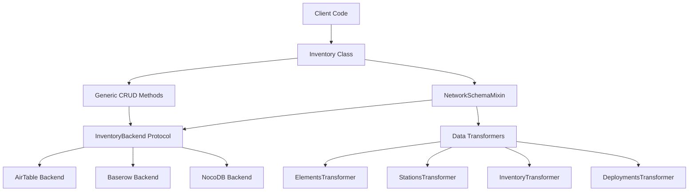

# Design Document

## Overview

This design extends the existing mbx-inventory system to include specialized methods for retrieving network schema data from inventory backends. The solution adds a new `NetworkSchemaMixin` class that provides domain-specific methods for each table in the network schema, while maintaining compatibility with the existing generic CRUD interface.

The design focuses on:
- Adding network schema-specific methods to the Inventory class
- Implementing data transformation and validation for each schema table
- Maintaining backend agnosticism (works with AirTable, Baserow, etc.)
- Providing clear error handling and data validation

## Architecture

### High-Level Architecture



### Class Structure

The design introduces a mixin pattern to extend the existing Inventory class:

```python
class NetworkSchemaMixin:
    """Mixin providing network schema-specific methods"""
    
class Inventory(NetworkSchemaMixin):
    """Extended inventory class with both generic and network-specific methods"""
```

## Components and Interfaces

### NetworkSchemaMixin Class

The core component that provides specialized methods for each network schema table:

```python
class NetworkSchemaMixin:
    def get_elements(self, filters: dict = None) -> list[dict]:
        """Retrieve elements data from inventory backend"""
        
    def get_component_models(self, filters: dict = None) -> list[dict]:
        """Retrieve component models data from inventory backend"""
        
    def get_stations(self, filters: dict = None) -> list[dict]:
        """Retrieve stations data from inventory backend"""
        
    def get_inventory(self, filters: dict = None) -> list[dict]:
        """Retrieve inventory items from inventory backend"""
        
    def get_deployments(self, filters: dict = None) -> list[dict]:
        """Retrieve deployments data from inventory backend"""
        
    def get_component_elements(self, filters: dict = None) -> list[dict]:
        """Retrieve component-element relationships from inventory backend"""
        
    def get_request_schemas(self, filters: dict = None) -> list[dict]:
        """Retrieve request schemas from inventory backend"""
        
    def get_response_schemas(self, filters: dict = None) -> list[dict]:
        """Retrieve response schemas from inventory backend"""
```

### Data Transformers

Each network schema table requires specific data transformation logic:

```python
class BaseTransformer:
    """Base class for data transformers"""
    
    @staticmethod
    def transform(raw_data: list[dict]) -> list[dict]:
        """Transform raw backend data to network schema format"""
        raise NotImplementedError
        
    @staticmethod
    def validate_required_fields(data: dict, required_fields: list[str]) -> None:
        """Validate that required fields are present"""

class ElementsTransformer(BaseTransformer):
    REQUIRED_FIELDS = ['element', 'description', 'description_short']
    OPTIONAL_FIELDS = ['si_units', 'us_units', 'extra_data']

class StationsTransformer(BaseTransformer):
    REQUIRED_FIELDS = ['station', 'name', 'status', 'latitude', 'longitude', 'elevation']
    OPTIONAL_FIELDS = ['date_installed', 'extra_data']
    VALID_STATUSES = ['pending', 'active', 'decommissioned', 'inactive']
```

### Table Name Mapping

Different inventory backends may use different table names. The design includes a configurable mapping system:

```python
class TableNameMapper:
    DEFAULT_MAPPINGS = {
        'elements': 'elements',
        'component_models': 'component_models', 
        'stations': 'stations',
        'inventory': 'inventory',
        'deployments': 'deployments',
        'component_elements': 'component_elements',
        'request_schemas': 'request_schemas',
        'response_schemas': 'response_schemas'
    }
    
    def __init__(self, custom_mappings: dict = None):
        self.mappings = {**self.DEFAULT_MAPPINGS, **(custom_mappings or {})}
```

## Data Models

### Network Schema Data Structures

Each method returns data structured to match the corresponding database schema:

#### Elements Data Structure
```python
{
    'element': str,           # Primary key
    'description': str,       # Required
    'description_short': str, # Required  
    'si_units': str | None,   # Optional
    'us_units': str | None,   # Optional
    'extra_data': dict | None # Optional - for additional backend fields
}
```

#### Stations Data Structure
```python
{
    'station': str,           # Primary key
    'name': str,              # Required
    'status': str,            # Required - must be valid status
    'date_installed': date | None, # Optional
    'latitude': float,        # Required
    'longitude': float,       # Required
    'elevation': float,       # Required
    'extra_data': dict | None # Optional - for additional backend fields
}
```

#### Inventory Data Structure
```python
{
    'model': str,             # Primary key part 1
    'serial_number': str,     # Primary key part 2
    'extra_data': dict | None # Optional - for additional backend fields
}
```

### Filter Parameter Structure

All methods accept optional filters to query specific data:

```python
filters = {
    'field_name': 'value',           # Exact match
    'field_name__in': ['val1', 'val2'], # Multiple values
    'field_name__contains': 'substring' # Partial match (if backend supports)
}
```

## Error Handling

### Exception Hierarchy

```python
class NetworkSchemaError(Exception):
    """Base exception for network schema operations"""

class ValidationError(NetworkSchemaError):
    """Raised when data validation fails"""

class TransformationError(NetworkSchemaError):
    """Raised when data transformation fails"""

class BackendError(NetworkSchemaError):
    """Raised when backend operations fail"""
```

### Error Handling Strategy

1. **Backend Errors**: Wrap backend-specific exceptions in `BackendError`
2. **Validation Errors**: Raise `ValidationError` for missing required fields or invalid data
3. **Transformation Errors**: Raise `TransformationError` for data conversion issues
4. **Graceful Degradation**: Return empty lists for non-existent tables rather than raising exceptions

## Testing Strategy

### Unit Tests

1. **Transformer Tests**: Test each transformer with various input data scenarios
2. **Mixin Method Tests**: Test each network schema method with mock backends
3. **Validation Tests**: Test error handling for invalid data
4. **Integration Tests**: Test with actual backend implementations

### Test Data Strategy

Create test fixtures that represent typical inventory backend data structures:

```python
SAMPLE_ELEMENTS_DATA = [
    {
        'id': 'rec123',
        'element': 'TEMP',
        'description': 'Air Temperature',
        'description_short': 'Temp',
        'si_units': 'Celsius',
        'us_units': 'Fahrenheit'
    }
]
```

### Mock Backend Strategy

Create mock backends that simulate different data scenarios:
- Valid data
- Missing required fields
- Invalid data types
- Backend connection failures

## Implementation Considerations

### Backward Compatibility

The design maintains full backward compatibility:
- Existing `Inventory` class interface remains unchanged
- Generic CRUD methods continue to work as before
- New methods are additive only

### Performance Considerations

1. **Lazy Loading**: Methods only fetch data when called
2. **Caching**: Consider adding optional caching for frequently accessed data
3. **Batch Operations**: Leverage existing backend batch capabilities where possible

### Configuration Options

Allow customization through constructor parameters:

```python
inventory = Inventory(
    backend=airtable_backend,
    table_mappings={'elements': 'sensor_elements'},  # Custom table names
    strict_validation=True,  # Fail on validation errors vs. warnings
    transform_extra_fields=True  # Include unmapped fields in extra_data
)
```

### Backend-Specific Considerations

#### AirTable
- Field names may have spaces and special characters
- Record IDs are provided automatically
- Supports rich data types (attachments, formulas)

#### Baserow/NocoDB
- More traditional database-like field names
- May have different ID field naming conventions
- Different API response structures

## Future Extensions

### Relationship Handling

Future versions could add methods that automatically resolve relationships:

```python
def get_stations_with_deployments(self) -> list[dict]:
    """Get stations with their current deployments included"""

def get_inventory_with_availability(self) -> list[dict]:
    """Get inventory items with deployment status"""
```

### Bulk Synchronization

Add methods for bulk data synchronization:

```python
def sync_all_network_data(self) -> dict:
    """Sync all network schema tables and return summary"""

def sync_table(self, table_name: str) -> dict:
    """Sync specific table and return summary"""
```