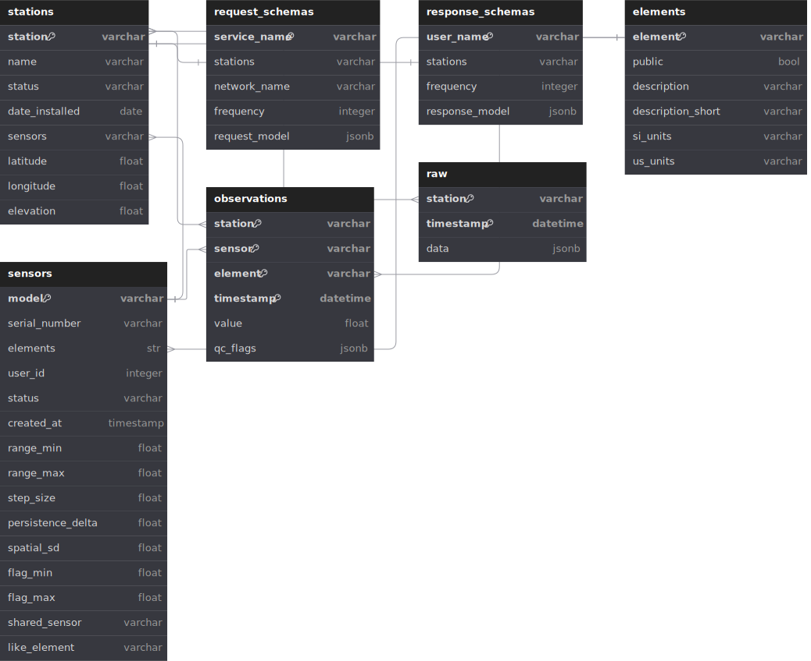

# The Mesonet Database

mesonet-in-a-box uses [TimescaleDB](https://www.timescale.com/) for its database. TimescaleDB is a extension to PostgreSQL that is optimized for timeseries data. The database structure is outlined in the diagram below:

